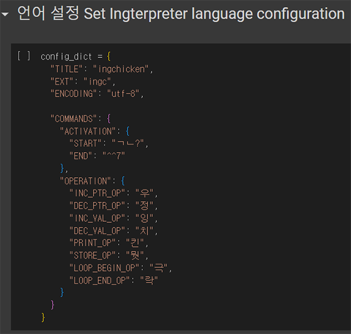
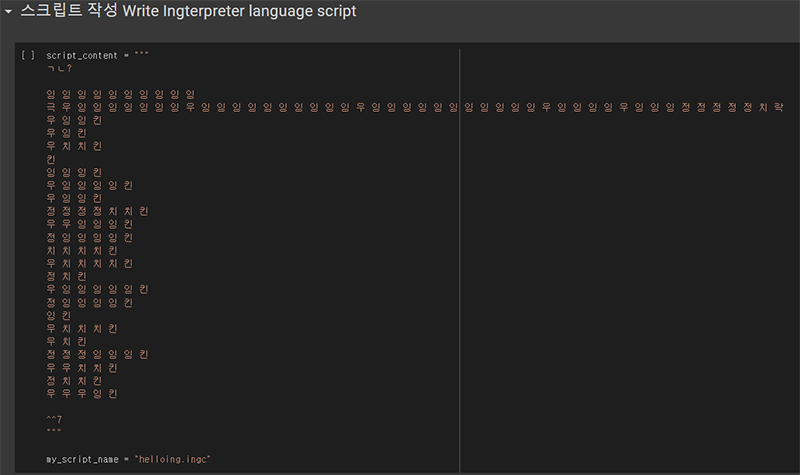
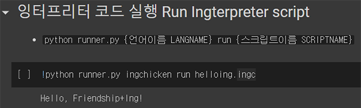
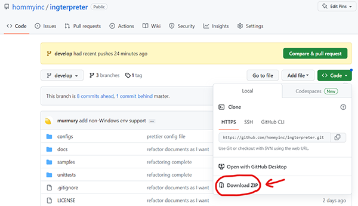

# 잉터프리터 Ingterpreter
- 갖고 놀 수 있는 프로그래밍 언어 toy programming language anyone can play with
- 원 소스 개발자의 `README`를 읽어주세요 Please read the `README` written by the original author : [**README**](./docs/README.md)
- 이 프로젝트는 원 소스 개발자의 `알아서 하셔 LICENSE`를 그대로 따릅니다 This work follows the `All Author Hi Sure Public License` with respect to the license of the original distributor : [**LICENSE**](./LICENSE)

## 사용하기 How to use

### 방법 1) 구글 코랩에서 실행 Run on Google Colab
- 1. 코랩 열기 Open in Colab : 
- 2. 언어 설정 파일 작성 Write your own Ingterpreter language configuration file
    
- 3. 스크립트 작성 Write your own Ingterpreter language script file
    
- 4. 스크립트 실행 Run your Ingterpreter script file
    

### 방법 2) 컴퓨터에 다운받아 실행 Run on local environment
- 1. 파이썬 3 설치 Get Python 3 on your local system.
- 2. 이 소스 다운받기 Get this source code on your local system.
    - 2-1. 깃으로 다운 Get it with Git command `git clone https://github.com/hommyinc/ingterpreter && cd ingterpreter/`
    - 2-2. 직접 다운로드 Download it as ZIP archive
        
- 3. 쉘에 명령어 등록 Register your language configuration on your shell.
    - `python runner.py install {언어이름 LANGNAME}`
        - ex) `python runner.py install ingchicken`
        - ※ 언어 설정 JSON 파일이 `configs/` 폴더에 들어가 있어야 함! Note that JSON language configuration file must be uploaded on `configs/` folder!
- 4. 브레인퍽 스크립트를 잉터프리터 언어로 변환 Convert Brainfuck script into your own Ingterpreter script.
    - `{언어이름 LANGNAME} convert b2i {○○○.bf} {○○○.ext}` or `python runner.py convert {언어이름 LANGNAME} b2i {○○○.bf} {○○○.ext}`
        - ex) `ingchicken convert b2i helloworld.bf helloworld.ingc`
        - ※ 반대로 잉터프리터 언어 스크립트를 브레인퍽 스크립트로도 변환 가능합니다. You can also convert Ingterpreter script into Brainfuck script.
- 5. 잉터프리터 스크립트 실행 Run Ingterpreter script on your shell.
    - `{언어이름 LANGNAME} run {○○○.ext}` or `python runner.py run {언어이름 LANGNAME} {○○○.ext}`
        - ex) `ingchicken run helloworld.ingc`
        - ※ `{언어이름}`을 쉘 명령어로 사용하기 위해서는 `python runner.py install {언어이름}`으로 설치 후 쉘을 껐다가 켜줘야 등록됩니다. `{LANGNAME}` can be used as shell command when you install via `python runner.py install {LANGNAME}`, exit your shell and re-open it.
- 6. 쉘에 명령어 등록 해제 Remove your language command from your shell.
    - `python runner.py uninstall {언어이름 LANGNAME}`
        - ex) `python runner.py uninstall ingchicken`

## 감사를 전합니다 in honor of
- 클렌지잉폼 cleansINGfoam
    - 2023년 5월 `잉터프리터`를 최초 개발 및 굉장히 관대한 라이선스로 배포 the very smart Ingmono who developed original source of `Ingterpreter` in May 2023 and distributed it with a very permissive license
    - [초기 버젼 게시글 article of the original initial distribution](https://m.cafe.daum.net/ingsfriend/pr5R/4516?svc=cafeapp)
- 이선협 SunHyoup Lee a.k.a. [kciter](https://kciter.so/about)
    - 2022년 9월 `잉터프리터`의 벤치마킹 언어 `재즈랭`을 개발 the developer of `Jazzlang` in Sep 2022
    - `재즈랭` 공식 레포 official repository of `Jazzlang` : [GitHub](https://github.com/kciter/jazzlang)
    - [개발 기록 "난해한 프로그래밍 언어 만들어보기" devlog "developing a custom esoteric programming language"](https://kciter.so/posts/crafting-esolang)
- 우어반 뮐러 Urban Müller
    - 1993년 브레인퍽을 제작 the developer of `Brainfuck` in 1993
    - [Esolang, the esoteric programming languages wiki](https://esolangs.org/wiki/Brainfuck)
- 우정잉 Friendship+Ing
    - 종합 스트리머, 50만 구독 유튜버, 인플루언서 겸 현존 최고 아이돌 중 하나 Twitch top streamer, 500k+ subscribed YouTuber, Korean influencer, and one of the best K-Idol in existence
    - 경북대학교 문헌정보학사 및 컴퓨터학과 부전공 출신, graduate of Kyungpook Nat'l Univ. majored in Library and Information Science and minored in Computer Science
    - 넥슨 산하 웹예능 채널 "[넥넥](https://www.youtube.com/@NEXON_unofficial)"의 코딩 교육 웹예능 [<헬로, 월드>](https://www.youtube.com/playlist?list=PLAVSeDXrlV34lX54OX5vZZCG82Gi-NkGJ) 진행자 the main host of software coding educational series [\<〉hello, world_\>](https://www.youtube.com/playlist?list=PLAVSeDXrlV34lX54OX5vZZCG82Gi-NkGJ), an entertainment show produced from YouTube channel owned by Nexon, Inc. "[NexNex](https://www.youtube.com/@NEXON_unofficial)"