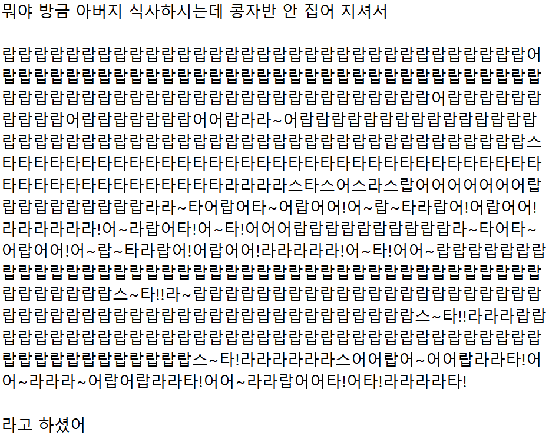
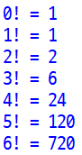
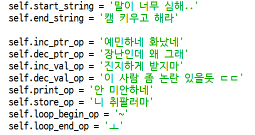
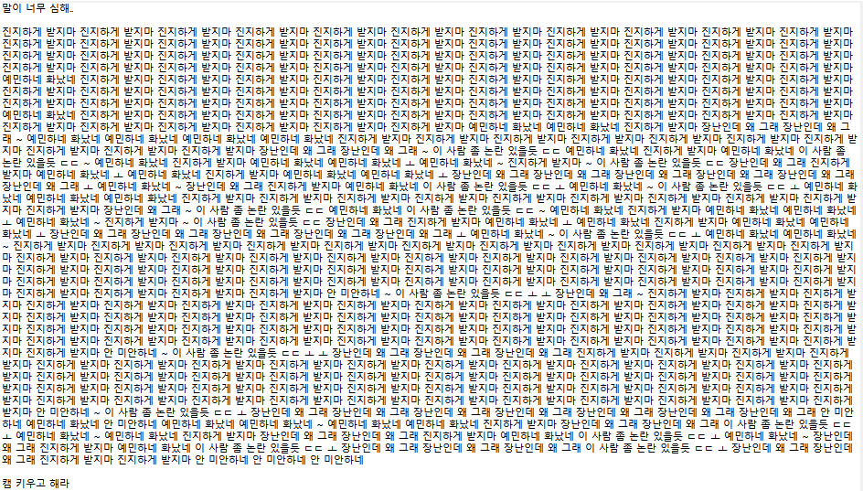
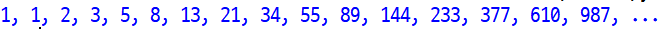
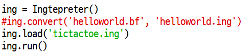

# 갖고 놀 수 있는 프로그래밍 언어 잉터프리터
- 원글 출처: [다음 카페 Daum Cafe](https://m.cafe.daum.net/ingsfriend/pr5R/4516?svc=cafeapp)
- 원글 작성자: [클렌지잉폼 @ cafe.daum.net/ingsfriend](https://cafe.daum.net/ingsfriend)
- 원글 작성일시: 2023.05.09 20:18

안녕 잉친이들

오늘 할일이 엄청 많은데 청개구리 근성으로 괜히 딴짓하고 싶더라구

그래서 두어시간 동안 이거 만들어봤어

재밌게 갖고 놀아주라

 

## 1. AuraLobster

`AuraLobster` ~~어라랍스타~~ 언어는 `brainfuck`이라는 언어와 1대1 매칭되는 언어야

어라랍스타어는 `'뭐야 방금 아버지 식사하시는데 콩자반 안 집어 지셔서'`로 시작하고 `'라고 하셨어'`로 끝나

둘 사이에 `어`, `라`, `랍`, `스`, `타`, `~`, `?`, `!` 를 사용하여 코딩하면 돼

### 예시)

라는 코드를 작성하면

팩토리얼을 출력해줘!

※ 이 구현은 https://kciter.so/posts/crafting-esolang 을 주로 참고했어

## 2. Ingtepreter

잉터프리터는 내가 원하는 언어를 직접 설정할 수 있는 확장판이야!

어라랍스터를 조금 더 고도화시킨거랄까..? 똑같이 `brainfuck`이랑 1대1 대응이야

잉터프리터 파일 최상단에 내가 원하는 문구를 집어넣으면 그 문구를 키워드로 프로그램을 짤 수 있어

나만의 프로그래밍 언어가 되는거지

### 예시)

예를 들어

이런 식으로 언어를 설정하고

이렇게 코드를 짜면

이렇게 피보나치가 출력 돼!

## 3. compatibility with [Brainfuck](https://esolangs.org/wiki/Brainfuck)

추가로 이 코드를 매번 짜긴 디게 힘들겠지?

그래서 잉터프리터와 어라랍스타 모두 `brainfuck` 파일을 변환할 수 있게 지원해줘

많이들 갖고 놀면 좋겠어~~

끝

## 4. 진짜 써보고 싶은 잉친이를 위한 사용방법

### 1) 환경

`python 3` 버전이 깔려있어야 해!

### 2) 어라랍스타 및 잉터프리터 실행 방법

좀 헷갈리면 파이썬 실행 방법을 찾으면 돼

파이썬이 깔린 상태에서 `.py` 파일에 우클릭 > `Edit with IDLE` > `F5` 누르기

### 3) 잉터프리터 언어 변경 방법

여기서 `self.loop_begin_op`와 `self.loop_end_op`는 한 글자만 가능하고, 나머지는 `' '` 사이를 자유롭게 바꾸면 돼!

### 4) brainfuck 변환 방법

`brainfuck`은 인터넷에 찾아보면 다양한 코드가 많이 나와.

그러면 그거를 메모장에 붙여넣고 원하는 이름으로 저장한뒤 잉터프리터나 어라랍스타를 IDLE로 열어줘

잉터프리터나 어라랍스타 제일 하단의 저 빨간 줄에서 맨 앞에 `#`를 없애고

`helloworld.bf` 자리에 `{저장한 brainfuck 코드 이름}`, `helloworld.ing` 자리에 `{저장하고 싶은 잉터프리터(어라랍스타)코드 이름}`을 넣고 `f5` 눌러서 실행하면 돼

물론 콘솔창을 필요로 하는 코드는 잘 실행이 안 될 수 있어 ㅠㅠ

이거 고치고 싶은 잉친이는 `getch` 부분을 찾아서 고쳐봐

진짜로 끝-